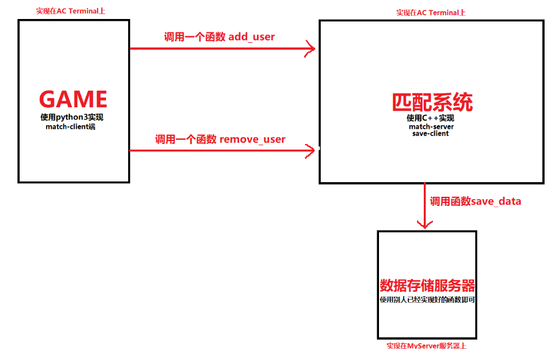
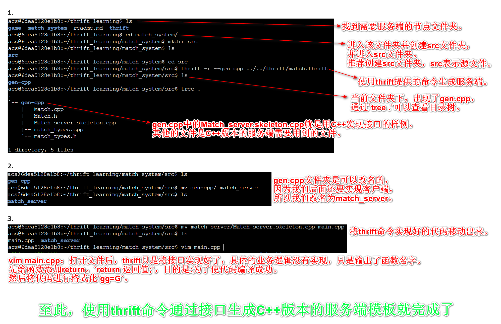
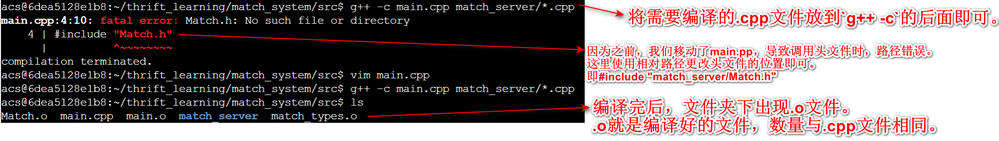
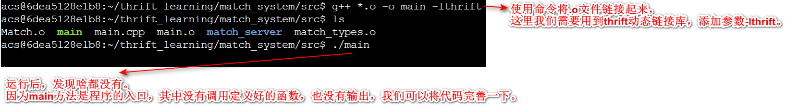
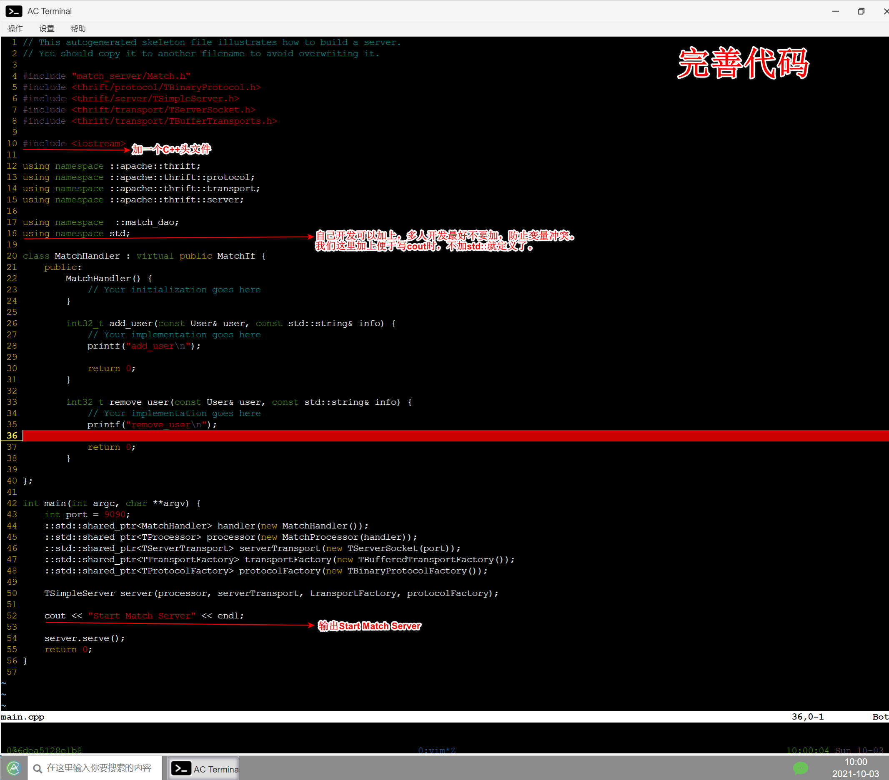
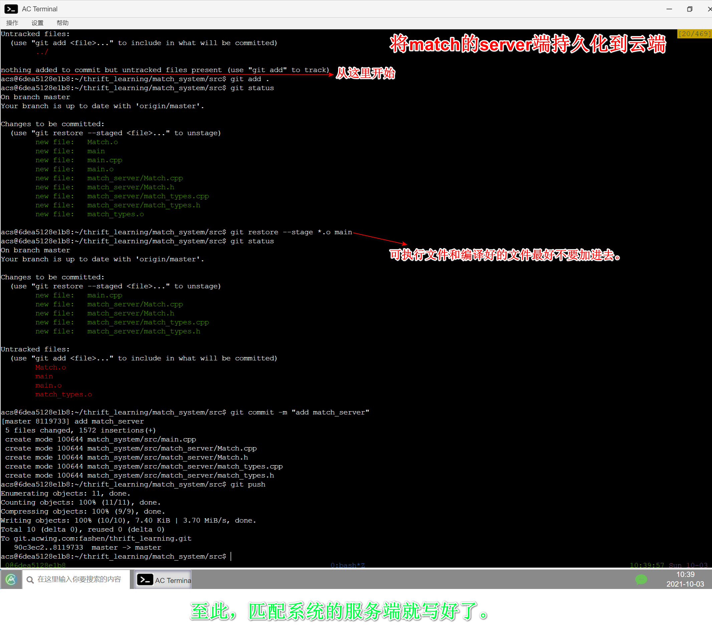
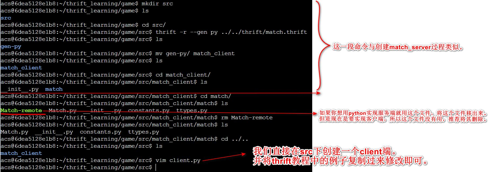
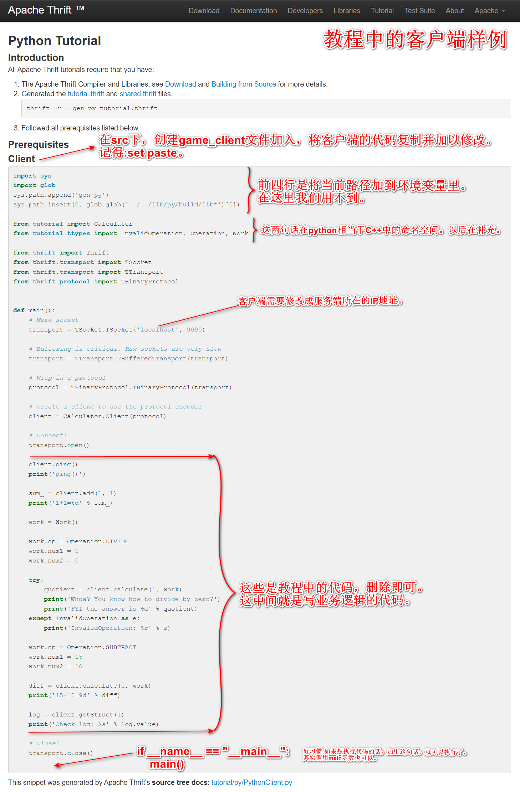
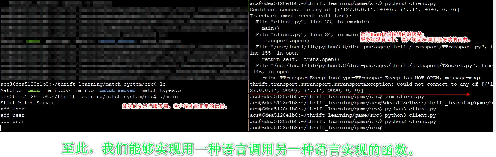
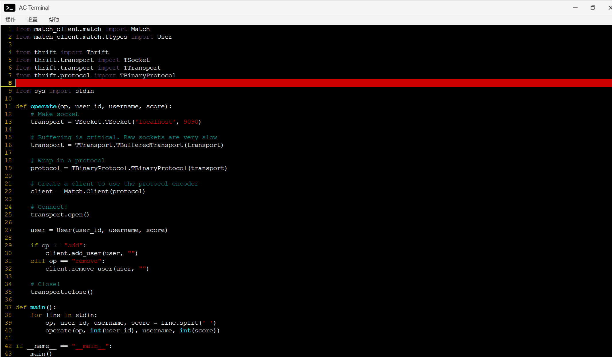

- [一个游戏的匹配服务分析](#一个游戏的匹配服务分析) 
- [实现一个游戏的匹配服务](#实现一个游戏的匹配服务) 
# thrift

我们写一个应用时，这个应用程序并不止一个服务，而且不同的服务分配到不同服务器（或者进程）上。也就是我们常说的微服务。

## 简介

[thrift官网][https://thrift.apache.org/] 进入官网->Tutorial->tutorial.thrift

Apache Thrift软件框架用于可伸缩的跨语言服务开发，它将软件栈和代码生成引擎结合在一起，以构建C++、Java、Python、PHP、Ruby、Erlang、Perl、Haskell、C#、Cocoa、JavaScript、Node.js、Smalltalk、OCaml和Delphi等语言之间高效、无缝地工作的服务。

~~~c++
thrift -version //查看thrift版本
~~~

## Thrift IDL

Thrift采用IDL(Interface Definition Language)来定义通用的服务接口，然后通过Thrift提供的编译器，可以将服务接口编译成不同语言编写的代码，通过这个方式来实现跨语言的功能。

- 通过命令调用Thrift提供的编译器将服务接口编译成不同语言编写的代码
- 这些代码又分为服务端和客户端，将所在不同进程（或服务器）的功能连接起来

~~~cpp
thrift -r --gen <language> <Thrift filename>
~~~

## 如何创建一个Thrift服务？

1. 定义服务接口（存放接口的文件夹就是thrift文件）
2. 作为服务端的服务，需要生成server
3. 作为请求端的服务，需要生成client

## 一个游戏的匹配服务分析

**分析图示内容**

这个游戏的功能可能运行在一个或多个服务器（或进程）上，而thrift就是将不同服务器不同语言的功能连接起来。图中的三个节点（功能）是完全独立的，既可以在同一个服务器上，也可以在不同服务器上。每一个节点就是一个进程，每个进程可以使用不同的语言来实现。

- 在GAME节点上实现客户端通过调用匹配系统的服务端中实现的两个服务接口函数获取功能，实现跨语言跨服务的工作。
- 每个节点(功能)之间通过thrift定义的服务接口作为有向边进行连接。弧尾所在的节点创建客户端，弧头所在的节点创建服务端。
- 匹配系统节点实现服务端，其中有一个匹配池：不断的接收玩家和删除玩家，同时根据一定的规则给每个玩家安排一局游戏。
- 匹配系统节点实现客户端，通过调用数据存储节点的服务端中实现的一个接口函数获取功能，实现跨语言跨服务的工作。
- 数据存储节点实现服务端。别人已经将服务接口和服务端实现好了。
- 服务接口功能介绍：add_user: 向匹配池中添加玩家。remove_user: 从匹配池中删除玩家。save_data :将匹配信息存储起来。

## 实现一个游戏的匹配服务

这里为了方便我们需要创建两个文件夹表示game节点(game)和匹配服务节点（match_system）,数据存储节点的服务端已经实现，只需调用服务接口实现的函数即可。

接下来创建一个thrift文件夹存储.thtift文件，.thrift文件定义服务接口。其中有两个,thrift文件表示两条有向边，一条有向边可以包含多个服务接口。

先定义服务接口。定义添加玩家和删除玩家的两个接口。在thrift文件夹中，创建match.thrift文件，然后进行接下来的内容。

### 1.名字空间NameSpace

Thrift中的命名空间类似于c++中的namespace和java中的package，它们提供了一种组织（隔离）代码的简便方式。名字空间也可以用于解决类型定义中的名字冲突。

由于每种语言均有自己的命名空间定义方式（如：python中有module）,thrift允许开发者针对特定语言定义namespace。

简单的demo：

~~~
namespace java com.xtxxtx.test
~~~

转换成

~~~
package com.xtxxtx.test
~~~

**教程中的介绍**

~~~cpp
/**
 * Thrift files can namespace, package, or prefix their output in various
 * target languages.
 */

namespace cl tutorial
namespace cpp tutorial  
namespace d tutorial
namespace dart tutorial
namespace java tutorial
namespace php tutorial
namespace perl tutorial
namespace haxe tutorial
namespace netstd tutorial

//匹配系统我们用C++实现。
//语法:namespace 使用的语言 空间名称
namespace cpp match_service

~~~

### 2.结构体struct

数据类型在结构体中定义。struct有以下一些约束：

1. struct不能继承，但是可以嵌套，不能嵌套自己。
2. 其成员都是有明确类型。
3. 成员都是被正整数编号过的，其中的编号是不能重复的，这个是为了在传输过程中编码使用。
4. 成员分隔符可以是逗号（,）或是分号（;）,而且可以混用
5. 每个字段可以设置默认值
6. 同一个文件可以定义多个struct,也可以定义在不同的文件，进行include引入

**教程中介绍:**

~~~cpp
/**
 * Structs are the basic complex data structures. They are comprised of fields
 * which each have an integer identifier, a type, a symbolic name, and an
 * optional default value.
 *
 * Fields can be declared "optional", which ensures they will not be included
 * in the serialized output if they aren't set.  Note that this requires some
 * manual management in some languages.
 */
 
struct Work {
  1: i32 num1 = 0, //默认值
  2: i32 num2, //默认字段类型是optional
  3: Operation op,
  4: optional string comment,
  5: required string name, //本字段必须填充
}

//这里我们定义结构体用来存储用户信息。其中i32表示int，string表示字符串。
struct User {
    1: i32 id,
    2: string name,
    3: i32 score,
}
~~~

规则

- 如果required标识的域没有赋值，Thrift将给予提示；
- 如果optional标识的域没有赋值，该域将不会被序列化传输；
- 如果某个optional标识域有缺省值而用户没有重新赋值，则该域的值一直为缺省值；
- 如果某个optional标识域有缺省值或者用户已经重新赋值，而不设置它的__isset为true，也不会被序列化传输。

### 3.服务定义类型Service

服务的定义方法在语义上等同于面向对象语言中的接口。比如java中的接口，只是参数需要加上编号。

**教程中介绍**

~~~cpp
/**
 * Ahh, now onto the cool part, defining a service. Services just need a name
 * and can optionally inherit from another service using the extends keyword.
 */
service Calculator extends shared.SharedService {

  /**
   * A method definition looks like C code. It has a return type, arguments,
   * and optionally a list of exceptions that it may throw. Note that argument
   * lists and exception lists are specified using the exact same syntax as
   * field lists in struct or exception definitions.
   */

   void ping(),

   i32 add(1:i32 num1, 2:i32 num2),

   i32 calculate(1:i32 logid, 2:Work w) throws (1:InvalidOperation ouch),

   /**
    * This method has a oneway modifier. That means the client only makes
    * a request and does not listen for any response at all. Oneway methods
    * must be void.
    */
   oneway void zip()

}

/**
  * 我们需要定义两个接口方法:add_user(), remove_user()
  * 其中`2: string info`表示额外信息。
  * 作用:以后想要更改接口时，不用更改接口，你可以直接将想传的信息传入到info中，
  * 然后对info进行序列化一个json即可。
  */
service Match {
    i32 add_user(1: User user, 2: string info),

    i32 remove_user(1: User user, 2: string info),
}

~~~

### 4.定义服务接口之后，先实现match_server

**如何通过接口生成C++版本的服务端**

~~~
//通过这个命令就可以实现，不过在此之前需要做一些准备工作。
//tutorial.thrift表示从当前目录到定义接口的路径。
thrift -r --gen cpp tutorial.thrift
~~~

具体操作如图所示：

- 做到这里我们发现：有了接口之后，通过命令就可以生成c++版本的服务端相关的代码。
- 写thrift服务的时候，先编译成功，然后再逐步向文件中添加模块。

### 5.如何编译thrift生成的c++代码？

因为Thrift由c++编写，所以编译的过程与c++一样。本质就是编译一堆c++源文件（.cpp）。

#### ①编译

#### ②链接

- 好习惯：可执行文件和编译好的文件最后不要加进去，只加.cpp和.h文件.

c++编译很慢，链接很快。所以每次修改项目，重新编译时，只需要编译修改过的.cpp文件即可，防止编译时间过长。即修改哪个文件就编译哪个文件。基于这一点考虑就有了make和cmake工具。

~~~cpp
//前面加上time查看编译和链接的时间。
time g++ -c .cpp文件
time g++ -o .o文件 -lthrift -pthread
~~~

### 6.实现match-client

~~~cpp
//使用该命令创建python版本的服务端，然后通过修改得到客户端。
//这个命令python2和python3是兼容的。
thrift -r --gen py tutorial.thrift
~~~

**现在client端还不是很方便。因为每次都需要运行一下代码，而且代码是写死的。**

### 7.将match-client的代码改成从标准输入中获取信息

至此，game的client端就完成了。最后将其持久化作为最终版。

**写server端需要分析业务模型。需要进行监控，支持增加用户和删除用户。同时还要有一个线程去不停地进行匹配。这个时候，我们发现需要实现两个功能，添加删除用户和匹配用户，根据微服务的概念需要开两个进程实现两个功能。**

### 8.完善match-server

完善server端需要并利用C++实现多线程。

编译c++时，如果用到线程，需要加上线程的动态链接库的参数 -pthread 。-lthrift参数将所有thrift动态链接文件连接起来。

~~~
g++ *.o -o main -lthrift -pthread
~~~

### 9.实现save_client

因为一个节点(功能)只能由一个main方法作为程序的入口，所以匹配系统中的客户端和服务端写在同一个main方法中。我们这里根据逻辑将其实现在一个函数中。

- 注意:复制教程中的代码时，一些细节需要更改。例如:其中带Calculator的字段都需要更改。
- 一些thrift接口和服务端有人会帮我们实现，这时我们只需调用接口实现的函数即可。例如:这里使用已经实现好的save_data()接口。

### 10. 升级match-server

一个线程处理输入输出，如果以后要处理并发量时，需要开多个线程处理。

### 11.将thrift的单独Server模式改成多线程Server模式

### 12.添加match-server的规则

匹配机制：等待时间越长，阈值越大。即匹配的范围随时间的推移而变大 故需要记录当前玩家在匹配池中等待的秒数。

至此，游戏的匹配服务就全部完成了。

## 改进match.thrift服务端

- 多线程thread：一个程序是一个进程，一个进程中至少有一个线程。如果只有一个线程，则第二个任务必须等到第一个任务结束后才能进行，如果使用多线程则在主线程执行任务的同时可以执行其他任务，而不需要等待。创建线程代价较小，但能有效提升cpu利用率。在本次项目中，我们需要输入用户信息和用户匹配是同时进行的，而不是输入用户信息结束才开始匹配，或匹配结束才能输入用户信息，所以我们需要开多线程编程。

- 生产者消费者模型：假如有两个线程A和B，A线程生产数据（类似本项目终端输入用户信息）并将信息加入缓冲区，B线程从缓冲区中取出数据进行操作（类似本项目中取出用户信息匹配），则A为生产者B为消费者。在多线程开发中，如果生产者生产数据的速度很快，而消费者消费数据的速度很慢，那么生产者就必须等待消费者消费完数据才能够继续生产数据，因为生产过多的数据可能会导致存储不足；同理如果消费者的速度大于生产者那么消费者就会经常处理等待状态，所以为了达到生产者和消费者生产数据和消费数据之间的平衡，那么就需要一个缓冲区用来存储生产者生产的数据，所以就引入了生产者-消费者模型。当缓冲区满的时候，生产者会进入休眠状态，当下次消费者开始消耗缓冲区的数据时，生产者才会被唤醒，开始往缓冲区中添加数据；当缓冲区空的时候，消费者也会进入休眠状态，直到生产者往缓冲区中添加数据时才会被唤醒
   -- 在本项目头文件中加入`#include <thread>`引入多线程

- 消息队列message_queue：在生产者消费者模型中我们提到了缓冲区，缓冲区的实现就是由队列来实现，当生产者生产数据后将信息入队，消费者获取信息后信息出队。消息队列提供了异步通信协议，也就是说，消息的发送者和接收者不需要同时与消息队列交互，消息会保存在队列中，直到接收者使用它
   -- 在本项目中手动实现消息队列，在头文件中加入`#include <queue>`，定义一个结构体将互斥锁mutex，队列queue和条件变量condition加入结构体即可

互斥锁mutex：保证共享数据操作的完整性，保证在任一时刻只能有一个线程访问对象。锁有两个操作。一个P操作(上锁)，一个V操作(解锁)。P和V都是原子操作，就是在执行P和V操作时，不会被插队。锁一般使用信号量来实现的，mutex其实就是信号量=1。互斥量就是同一时间能够分给一个人，即S=1。S=10表示可以将信号量分给10个人来用。如果一共有20个人那么只能有10个人用，剩下10个人需要等待。
 -- 在本项目中有两个操作添加用户和删除用户，信息都是存在消息队列当中，如果不上锁，这两个操作同时执行可能导致在消息队列当中信息错乱。在本项目头文件中加入`#include <mutex>`引入互斥锁

条件变量condition_variable：条件变量一般和互斥锁搭配使用，条件变量用于在多线程环境中等待特定事件发生。
 -- 在本项目中如果消息队列为空则等待，如果有添加用户和删除用户的操作则将消息队列唤醒

